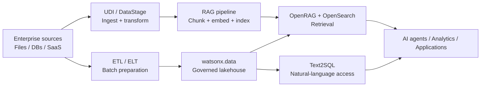

# Pipelines – Building Blocks

The **Pipelines** use case prepares, transforms, moves and indexes structured and unstructured data for analytics, RAG, search and AI applications.

---

## Available building blocks

| Capability | Products | Best fit |
|---|---|---|
| [RAG](rag/index.md) | IBM watsonx.data OpenRAG + OpenSearch | Enterprise retrieval and agent grounding |
| [Unstructured Data Integration (UDI)](udi/index.md) | IBM watsonx.data integration + Docling for IBM watsonx | Document ingestion, parsing, transformation, chunking and enrichment |
| [Text2SQL](text2sql/index.md) | IBM watsonx.data intelligence | Natural-language access to governed relational data |
| [ETL / ELT](etl/index.md) | IBM watsonx.data integration DataStage + IBM watsonx.data | Batch transformation and data movement |
| [Data Sync](data-sync/index.md) | IBM Aspera Sync | High-speed synchronization of files and large repositories over WAN |

---

## Business value

- **Shorten the path from raw data to AI-ready data:** structured pipelines eliminate ad hoc scripts and manual steps between sources and consumers.
- **Improve RAG retrieval quality:** document preparation via UDI and Docling means better extraction, chunking and indexing — which directly improves what AI retrieves.
- **Enable self-service analytics:** Text2SQL lets business users express queries in plain language while governance and SQL remain the execution layer.
- **Standardize repeatable integration:** DataStage flows, scheduling and connectors make batch ETL reproducible and governed.
- **Move large data globally:** Aspera Sync overcomes WAN latency for large file and repository distribution.

---

## When to use

| If you need to... | Use... |
|---|---|
| Ground AI agents in enterprise documents | [RAG](rag/index.md) |
| Ingest and prepare complex PDFs or unstructured content | [UDI](udi/index.md) |
| Let business users query governed data in plain English | [Text2SQL](text2sql/index.md) |
| Build repeatable batch ETL/ELT across enterprise systems | [ETL / ELT](etl/index.md) |
| Synchronize large file repositories across WAN or cloud sites | [Data Sync](data-sync/index.md) |

---

## Typical pattern

---

## Products used

| Product | Role |
|---|---|
| **IBM watsonx.data OpenRAG** | Managed enterprise RAG service with OpenSearch backend |
| **OpenSearch** | Search and vector retrieval backend for RAG |
| **IBM watsonx.data integration — UDI** | Visual, drag-and-drop unstructured document pipeline |
| **Docling for IBM watsonx** | Advanced document conversion for complex PDFs, tables and layouts |
| **IBM watsonx.data intelligence** | Metadata context for Text2SQL; natural-language query generation |
| **IBM DataStage (in watsonx.data integration)** | Visual ETL/ELT flow designer with enterprise connectors |
| **IBM Aspera Sync** | High-speed WAN file and repository synchronization |

---

## Design principles

- **Separate preparation from retrieval:** invest in upstream data quality (parsing, cleaning, chunking) before tuning retrieval or prompting.
- **Prefer governed pipelines over scripts:** use visual ETL and flow tooling for traceability and operational control.
- **Keep metadata with data:** always carry source identifiers, document names, permissions and lineage alongside transformed content.
- **Plan for change:** document updates, schema evolution and deleted records are first-class lifecycle events, not edge cases.
