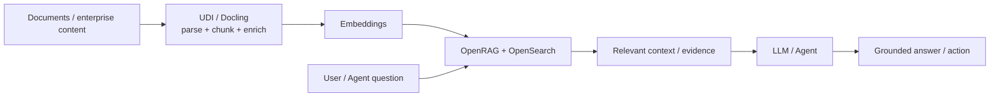

# RAG with OpenRAG and OpenSearch

Use **OpenRAG on IBM watsonx.data** to ground AI applications and agents in enterprise knowledge using document processing, semantic/vector retrieval, keyword search, hybrid retrieval and agentic retrieval patterns.

!!! info "Product mapping"
    **IBM watsonx.data OpenRAG + OpenSearch** — OpenSearch is automatically provisioned when OpenRAG is enabled in supported watsonx.data environments and serves as the required search backend.

!!! info "GitHub Repository"
    The complete source code and examples are available in the GitHub repository:

    [Building Blocks - RAG](https://github.com/ibm-self-serve-assets/building-blocks/tree/main/data/retrieval/RAG)

!!! warning "Architecture note"
    The RAG Building Block is a reusable accelerator and may implement a custom RAG pipeline rather than **OpenRAG** specifically. The current recommended product architecture is **IBM watsonx.data OpenRAG** — a managed enterprise RAG capability provisioned directly from watsonx.data. Refer to the [IBM OpenRAG provisioning documentation](https://www.ibm.com/docs/en/watsonxdata/saas?topic=openrag-provisioning) for details.

---

## Why It Matters

AI applications and agents that rely only on model memory will hallucinate, miss recent information and lack the specifics of your enterprise. RAG grounds every response in evidence retrieved from your own documents and data — making answers more accurate, explainable and trustworthy.

---

## Business Value

!!! success "Key outcomes"
    | Outcome | What It Means |
    |---|---|
    | **Ground AI in enterprise knowledge** | Retrieve evidence from business documents and data instead of relying on model memory alone |
    | **Improve answer relevance** | Use vector, keyword, hybrid and multi-step retrieval to find the most relevant content |
    | **Reduce custom RAG plumbing** | Provision an integrated enterprise retrieval capability instead of assembling every component manually |
    | **Support governed AI** | Combine retrieval with watsonx.data's broader data, access and governance foundation |
    | **Accelerate enterprise search** | Use the same retrieval foundation for search experiences and AI agents |

---

## When to Use

Use this building block when:

- Users ask questions over large document collections or enterprise knowledge bases.
- An AI agent needs **evidence-backed context** before taking an action.
- Keyword-only search misses semantically relevant content.
- You need a managed path from enterprise data to retrieval rather than a bespoke vector-only stack.

---

## Core Capabilities

| Capability | Description |
|---|---|
| **Enterprise document retrieval** | OpenSearch as the managed search and retrieval backend |
| **Semantic / vector search** | Meaning-based retrieval that goes beyond keyword matching |
| **Keyword search** | Exact terminology, identifiers and lexical matching |
| **Hybrid retrieval** | Combines lexical and semantic signals for higher-quality results |
| **Agentic retrieval** | Patterns that allow agents to select or sequence retrieval approaches |

---

## RAG Pattern

---

## What to Demonstrate

1. Provision or open the OpenRAG service.
2. Ingest a small, business-relevant document set.
3. Ask a question that keyword search alone would struggle with.
4. Show retrieved passages and evidence.
5. Compare keyword, semantic or hybrid behavior where the UI/API supports it.
6. Show the grounded response and source context.

---

## RAG Quality Considerations

!!! tip "Quality starts upstream"
    - Retrieval quality starts with document preparation — use UDI/Docling for complex documents.
    - Preserve document structure and meaningful metadata during chunking.
    - Evaluate retrieval **separately from generation** so poor answers can be traced to the right stage.
    - Use access controls appropriate to the source documents and downstream application.
    - Maintain an evaluation set of representative questions and expected supporting evidence.

---

## IBM Products Used

| Product | Role |
|---|---|
| **[IBM watsonx.data OpenRAG](https://www.ibm.com/products/watsonx-data/ai-enterprise-search)** | Managed enterprise RAG service — orchestrates retrieval, embedding and grounding |
| **[OpenSearch](https://www.ibm.com/docs/en/watsonxdata/saas?topic=openrag-provisioning)** | Search and vector retrieval backend, provisioned alongside OpenRAG |
| **[IBM watsonx.data](https://www.ibm.com/products/watsonx-data)** | Data platform foundation — governance, access control and broader data context |
