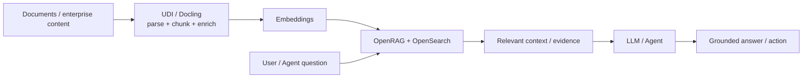

# RAG with OpenRAG and OpenSearch

Use **OpenRAG on IBM watsonx.data** to ground AI applications and agents in enterprise knowledge using document processing, semantic/vector retrieval, keyword search, hybrid retrieval and agentic retrieval patterns.

## Product mapping

**IBM watsonx.data OpenRAG + OpenSearch**.

OpenSearch is automatically added when OpenRAG is provisioned in supported watsonx.data environments, so it acts as the required search backend for OpenRAG.

## Business value

- **Ground AI in enterprise knowledge:** retrieve evidence from business documents and data instead of relying only on model memory.
- **Improve answer relevance:** use vector, keyword, hybrid and multi-step retrieval approaches.
- **Reduce custom RAG plumbing:** provision an integrated enterprise retrieval capability instead of assembling every component manually.
- **Support governed AI:** combine retrieval with watsonx.data's broader data, access and governance foundation.
- **Accelerate enterprise search:** use the same retrieval foundation for search experiences and AI agents.

## When to use

Use this building block when:

- Users ask questions over large document collections or enterprise knowledge bases.
- An AI agent needs evidence-backed context before taking an action.
- Keyword-only search misses semantically relevant content.
- You need a managed path from enterprise data to retrieval rather than a bespoke vector-only stack.

## OpenRAG pattern

## Core capabilities

- Enterprise document retrieval using OpenSearch.
- Semantic/vector search for meaning-based retrieval.
- Keyword search for exact terminology and identifiers.
- Hybrid retrieval that combines lexical and semantic signals.
- Agentic retrieval patterns that can select or sequence retrieval approaches.
- Integration with IBM watsonx.ai or supported model providers, depending on deployment.

## What to demonstrate

1. Provision or open the OpenRAG service.
2. Ingest a small, business-relevant document set.
3. Ask a question that keyword search alone would struggle with.
4. Show retrieved passages/evidence.
5. Compare keyword, semantic or hybrid behavior where the UI/API supports it.
6. Show the grounded response and source context.

## RAG quality considerations

- Retrieval quality starts with document preparation; use UDI/Docling for complex documents.
- Preserve document structure and meaningful metadata during chunking.
- Evaluate retrieval separately from generation so poor answers can be traced to the right stage.
- Use access controls appropriate to the source documents and downstream application.
- Maintain an evaluation set of representative questions and expected supporting evidence.

## Official references

- [Provisioning OpenRAG in watsonx.data](https://www.ibm.com/docs/en/watsonxdata/saas?topic=openrag-provisioning)
- [AI enterprise search with OpenRAG](https://www.ibm.com/products/watsonx-data/ai-enterprise-search)
- [IBM watsonx.data](https://www.ibm.com/products/watsonx-data)
