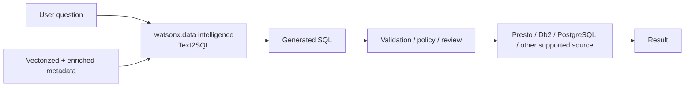

# Text2SQL

Use **IBM watsonx.data intelligence** to convert natural-language requests into SQL by using vectorized and enriched metadata as context — giving business users self-service access to governed relational data.

!!! info "Product mapping"
    **IBM watsonx.data intelligence** — Text2SQL, natural-language query, vectorized metadata

!!! info "GitHub Repository"
    The complete source code and examples are available in the GitHub repository:

    [Building Blocks - Text2SQL](https://github.com/ibm-self-serve-assets/building-blocks/tree/main/data/intelligence/text2sql)

---

## Why It Matters

Most business users cannot write SQL. Analytical questions go unanswered or are queued to data teams, creating bottlenecks and delaying decisions. Text2SQL changes this by letting users ask questions in plain language, generating SQL behind the scenes and returning results through existing governed data infrastructure.

---

## Business Value

!!! success "Key outcomes"
    | Outcome | What It Means |
    |---|---|
    | **Broaden data access** | Users can express analytical intent without writing SQL by hand |
    | **Reduce routine analyst workload** | Common exploratory queries can be generated faster, freeing analysts for higher-value work |
    | **Use governed metadata as context** | Table and column descriptions plus business terms improve query generation quality |
    | **Keep SQL visible** | Generated SQL can be reviewed, governed and executed through existing database controls |
    | **Accelerate self-service BI** | Business users get answers in natural language while IT retains governance |

---

## When to Use

Text2SQL is a good fit when:

- Business users need **self-service access** to relational data without SQL skills.
- Data teams want to accelerate ad-hoc exploration while keeping SQL as the execution interface.
- The schema is **well-governed and metadata is enriched** with meaningful descriptions and terms.

!!! warning "What Text2SQL is not"
    Do not treat Text2SQL as a replacement for authorization, row/column security, query limits or review of high-impact queries. Generated SQL must still flow through existing data access controls.

---

## How It Works

IBM watsonx.data intelligence can vectorize project metadata for natural-language queries. The metadata is used to generate SQL based on available tables and columns. IBM documentation recommends **metadata enrichment** before using Text2SQL because enriched metadata adds descriptive, business-relevant context that directly improves generation quality.

---

## What to Demonstrate

1. Select a governed project with representative tables.
2. Show enriched table and column descriptions and business terms.
3. Ask a business question in natural language.
4. Show the generated SQL **before** execution.
5. Execute the query against a supported data source.
6. Refine the metadata and show how better descriptions improve results.

---

## Best Practices

!!! tip "Metadata first, then Text2SQL"
    - Enrich metadata before measuring Text2SQL quality.
    - Use clear business terms and examples for ambiguous metrics.
    - Keep a test set of expected questions and validate both SQL semantics and execution results.
    - Apply database-native authorization and query governance to all generated SQL.
    - Prefer read-only execution paths for broad self-service scenarios.

---

## Demo Videos

<video width="100%" controls>
  <source src="demos/text-to-sql-demo.mp4" type="video/mp4">
  Your browser does not support the video tag.
</video>

---

## IBM Products Used

| Product | Role |
|---|---|
| **[IBM watsonx.data intelligence — Text2SQL](https://www.ibm.com/docs/en/watsonx/wdi/2.4.x?topic=tools-data-intelligence)** | Natural-language query generation using vectorized and enriched metadata as context |
| **[IBM watsonx.data intelligence — Metadata Enrichment](https://www.ibm.com/docs/en/watsonx/wdi/2.4.x?topic=data-enriching-your-assets)** | Provides business terms, descriptions and semantic context that improve Text2SQL quality |
