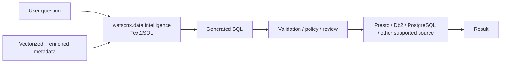

# Text2SQL

Use **IBM watsonx.data intelligence** to convert natural-language requests into SQL by using vectorized and enriched metadata as context.

## Business value

- **Broaden data access:** users can express analytical intent without writing SQL by hand.
- **Reduce routine analyst workload:** common exploratory queries can be generated faster.
- **Use governed metadata as context:** table/column descriptions and business terms improve query generation quality.
- **Keep SQL visible:** generated SQL can be reviewed, governed and executed through existing database controls.

## When to use

Text2SQL is a good fit when:

- Business users need self-service access to relational data.
- Data teams want to accelerate ad-hoc exploration while keeping SQL as the execution interface.
- The schema is well-governed and metadata can be enriched with meaningful descriptions and terms.

Do not treat Text2SQL as a replacement for authorization, row/column security, query limits or review of high-impact queries.

## How it works

IBM watsonx.data intelligence can vectorize project metadata for natural-language queries. The metadata is used to generate SQL based on available tables and columns. IBM documentation recommends metadata enrichment to improve Text2SQL performance because enriched metadata adds descriptive, business-relevant context.

## What to demonstrate

1. Select a governed project with representative tables.
2. Show enriched table and column descriptions/business terms.
3. Ask a business question in natural language.
4. Show the generated SQL before execution.
5. Execute the query against a supported data source.
6. Refine the metadata and show how better descriptions improve results.

## Best practices

- Enrich metadata before measuring Text2SQL quality.
- Use clear business terms and examples for ambiguous metrics.
- Keep a test set of expected questions and validate both SQL semantics and execution results.
- Apply database-native authorization and query governance to generated SQL.
- Prefer read-only execution paths for broad self-service scenarios.

## Current product caveat

Some generative capabilities can be deployment- or version-dependent, and IBM documentation can label specific natural-language SQL asset creation features as technology preview in certain releases. Confirm the status in the target watsonx.data intelligence environment before committing to a production architecture.

## Demo videos

<video width="100%" controls>
  <source src="demos/text-to-sql-demo.mp4" type="video/mp4">
  Your browser does not support the video tag.
</video>

## Official references

- [Data intelligence tools settings and natural-language queries](https://www.ibm.com/docs/en/watsonx/wdi/2.4.x?topic=tools-data-intelligence)
- [Metadata enrichment](https://www.ibm.com/docs/en/watsonx/wdi/2.4.x?topic=data-enriching-your-assets)
