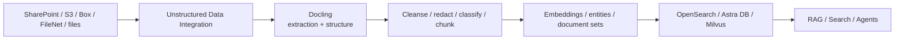

# Unstructured Data Integration (UDI)

Use **IBM watsonx.data integration Unstructured Data Integration** to ingest, cleanse, transform and enrich unstructured content for RAG and AI. Use **Docling for IBM watsonx** when complex documents need high-quality conversion into structured, AI-ready representations.

!!! info "Product mapping"
    - **IBM watsonx.data integration — Unstructured Data Integration (UDI)** — visual, drag-and-drop document pipeline
    - **Docling for IBM watsonx** — managed document intelligence and conversion for complex layouts

!!! info "GitHub Repository"
    The complete source code and examples are available in the GitHub repository:

    [Building Blocks - UDI](https://github.com/ibm-self-serve-assets/building-blocks/tree/main/data/integration/data-pipeline-ai-generated)

---

## Why It Matters

Enterprise knowledge is locked in PDFs, presentations, scanned documents, contracts and reports. Before any of it can be retrieved or used by AI, it must be extracted, cleaned, chunked and indexed correctly. Poor document preparation is the leading cause of poor RAG quality — UDI and Docling address this directly.

---

## Business Value

!!! success "Key outcomes"
    | Outcome | What It Means |
    |---|---|
    | **Turn enterprise documents into AI-ready data** | Structure PDFs, images, presentations and complex content for indexing and retrieval |
    | **Improve RAG retrieval quality** | Better extraction, layout preservation, chunking and enrichment improve what gets indexed |
    | **Automate repeatable document pipelines** | Schedule flows that detect and process changed documents without manual rebuilds |
    | **Reduce sensitive-data risk** | Use processing steps such as filtering and PII redaction where applicable |
    | **Support multiple vector targets** | Route prepared content into OpenSearch, Milvus or Astra DB depending on deployment |

---

## When to Use

**Use UDI when:**

- Raw documents need extraction, cleansing, chunking or enrichment before retrieval.
- You need a visual, repeatable pipeline for continuously updated document sources.
- RAG quality is limited by poor PDF parsing, tables, reading order or document structure.
- You need to preserve source permissions/ACL context where supported.

**Use Docling when:**

- Document structure itself is a major problem — complex PDFs, tables, presentations or scanned/visual layouts.
- The document must become structured output (Markdown, JSON, HTML) for downstream AI consumption.

---

## Reference Flow

---

## UDI Capabilities

IBM documentation describes UDI as a drag-and-drop flow experience with pre-built modules for document ingestion and transformations such as extraction, filtering and PII redaction. Flows can be scheduled so that only **changed documents are processed**, reducing unnecessary reprocessing.

## Docling Capabilities

Docling for IBM watsonx converts complex unstructured documents into structured outputs such as Markdown, JSON and HTML. It is designed for:

- Document conversion and information extraction
- Data preparation and document understanding
- RAG, enterprise search and agent workflows
- Preserving tables, reading order and document layout structure

---

## What to Demonstrate

1. Load a representative complex PDF or presentation.
2. Show the structured output with preserved tables and reading order.
3. Build a UDI flow that cleans, chunks and enriches the content.
4. Store the result in a supported vector target.
5. Run a retrieval question against the processed content.
6. Compare the result with a naive text extraction if possible.

---

## Design Considerations

!!! tip "Document pipelines need care"
    - Use **document-aware chunking** rather than fixed character splits for complex documents.
    - Keep source metadata — document name, page, section, permissions — alongside chunks.
    - Separate extraction errors from embedding/retrieval errors during troubleshooting.
    - Treat document updates and deletions as first-class lifecycle events.
    - Define evaluation documents that contain tables, images and multi-column layouts — not only simple text PDFs.

---

## IBM Products Used

| Product | Role |
|---|---|
| **[IBM watsonx.data integration — UDI](https://www.ibm.com/docs/en/watsonx/wdi/2.4.x?topic=data-integrating-unstructured-documents)** | Visual drag-and-drop pipeline for document ingestion, transformation, chunking and enrichment |
| **[Docling for IBM watsonx](https://www.ibm.com/products/docling)** | Advanced document conversion — complex PDFs, tables, scanned layouts → structured AI-ready output |
