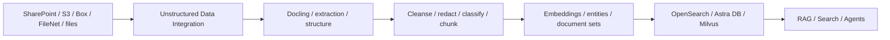

# Unstructured Data Integration (UDI)

Use **IBM watsonx.data integration Unstructured Data Integration** to ingest, cleanse, transform and enrich unstructured content for RAG and AI. Use **Docling for IBM watsonx** when complex documents need high-quality conversion into structured, AI-ready representations.

## Product mapping

- **IBM watsonx.data integration — Unstructured Data Integration**
- **Docling for IBM watsonx** for managed document intelligence and conversion

## Business value

- **Turn enterprise documents into AI-ready data:** structure PDFs, images, presentations and other complex content.
- **Improve RAG retrieval quality:** better extraction, layout preservation, chunking and enrichment improve what gets indexed.
- **Automate repeatable document pipelines:** schedule flows that detect and process changed documents rather than rebuilding everything manually.
- **Reduce sensitive-data risk:** use processing steps such as filtering and PII redaction where applicable.
- **Support multiple vector targets:** route prepared content into supported stores such as OpenSearch, Milvus or Astra DB, depending on deployment/version.

## When to use

Use UDI when:

- Raw documents need extraction, cleansing, chunking or enrichment before retrieval.
- You need a visual, repeatable pipeline for continuously updated document sources.
- RAG quality is limited by poor PDF parsing, tables, reading order or document structure.
- You need to preserve source permissions/ACL context where supported.

Use Docling when document structure itself is a major problem—for example, complex PDFs, tables, presentations or scanned/visual layouts that need to become structured outputs for AI.

## Reference flow

## UDI capabilities

IBM documentation describes UDI as a drag-and-drop flow experience with pre-built modules for document ingestion and transformations such as extraction, filtering and PII redaction. Flows can be scheduled so that only changed documents are processed.

## Docling capabilities

Docling for IBM watsonx converts complex unstructured documents into structured outputs such as Markdown, JSON and HTML. It is designed for document conversion, information extraction, data preparation, document understanding, RAG, enterprise search and agent workflows.

## What to demonstrate

1. Load a representative complex PDF or presentation.
2. Show the structured output and preserved tables/reading order.
3. Build a UDI flow that cleans, chunks and enriches the content.
4. Store the result in a supported vector target.
5. Run a retrieval question against the processed content.
6. Compare the result with a naive text extraction if possible.

## Design considerations

- Use document-aware chunking rather than fixed character splits for complex documents.
- Keep source metadata such as document name, page, section and permissions alongside chunks.
- Separate extraction errors from embedding/retrieval errors during troubleshooting.
- Treat document updates and deletions as first-class lifecycle events.
- Define evaluation documents that contain tables, images and multi-column layouts—not only simple text PDFs.

## Official references

- [Integrating unstructured data documents](https://www.ibm.com/docs/en/watsonx/wdi/2.4.x?topic=data-integrating-unstructured-documents)
- [Docling for IBM watsonx](https://www.ibm.com/products/docling)
