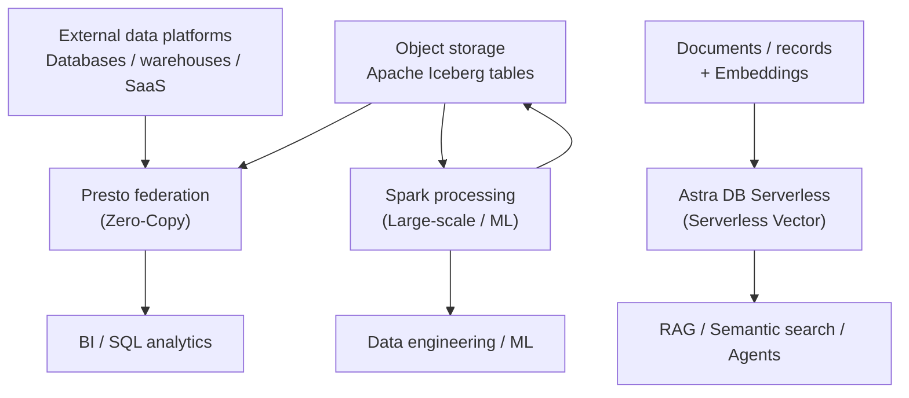

# Query Engines – Building Blocks

The **Query Engines** use case provides fit-for-purpose execution for SQL analytics, large-scale processing, open lakehouse interoperability and vector retrieval — matching the engine to the workload rather than routing everything through a single technology.

---

## Available building blocks

| Capability | Products | Best fit |
|---|---|---|
| [Zero-Copy Lakehouse](zero-copy-lakehouse/index.md) | IBM watsonx.data: Presto + Spark + Apache Iceberg | Federated access, interactive SQL, large-scale processing and open tables |
| [Serverless Vector](serverless-vector/index.md) | IBM watsonx.data + Astra DB Serverless | Vector similarity search for RAG, semantic search and AI applications |

---

## Business value

- **Reduce unnecessary data movement:** query supported external platforms in place, removing ETL hops that exist only to make data accessible elsewhere.
- **Use the right engine for each workload:** Presto for interactive SQL, Spark for distributed processing, a vector engine for similarity retrieval.
- **Preserve open interoperability:** Apache Iceberg lets multiple engines share the same governed tables without proprietary lock-in.
- **Elastic vector capacity:** serverless vector databases scale with application demand without cluster provisioning overhead.
- **Lower total cost of ownership:** avoid duplicated storage and redundant copies of the same data.

---

## When to use

| If you need to... | Use... |
|---|---|
| Query distributed data across platforms without copying it | [Zero-Copy Lakehouse](zero-copy-lakehouse/index.md) |
| Run interactive SQL analytics across a governed lakehouse | [Zero-Copy Lakehouse](zero-copy-lakehouse/index.md) — Presto |
| Large-scale data processing, transformation or ML prep | [Zero-Copy Lakehouse](zero-copy-lakehouse/index.md) — Spark |
| Store embeddings and run vector similarity search for RAG | [Serverless Vector](serverless-vector/index.md) |
| Elastic, API-driven vector storage without cluster management | [Serverless Vector](serverless-vector/index.md) |

---

## Typical pattern

---

## Products used

| Product | Role |
|---|---|
| **IBM watsonx.data** | Unified data platform hosting Presto, Spark, Iceberg and Astra DB |
| **Presto** | Interactive, distributed SQL query engine for analytics across connected sources |
| **Apache Spark** | Distributed processing for large-scale transformations, ingestion and ML workloads |
| **Apache Iceberg** | Open table format enabling multi-engine access with schema evolution and ACID properties |
| **Astra DB Serverless** | Serverless vector database for embeddings, similarity search and RAG |

---

## Design principle

Do not force every workload through one engine. Use **Presto** for interactive SQL, **Spark** for distributed processing and complex transformation, and a **vector engine** for similarity retrieval. Apache Iceberg keeps analytic data interoperable across engines, and federation reduces the need to copy data that already lives in an accessible system.

---

## When not to use federation

Federation is not always the right choice. For highly repeated, latency-sensitive queries — or when a source system cannot efficiently push down predicates — materialize, cache or ingest the data instead. Query engines complement a well-designed data pipeline; they do not replace it.
