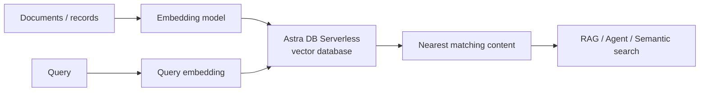

# Serverless Vector

Use **Astra DB Serverless through IBM watsonx.data** for elastic vector storage and similarity search in RAG, semantic search and AI application patterns.

## Product mapping

**IBM watsonx.data + Astra DB Serverless**.

Current watsonx.data documentation supports adding an Astra DB service and provisioning either **Serverless (vector)** or **Serverless (tables)** databases from the watsonx.data infrastructure experience.

## Business value

- **Avoid vector-cluster operations:** serverless capacity scales with application usage instead of requiring teams to provision and tune a traditional vector cluster.
- **Support RAG and semantic search:** store embeddings and run approximate nearest-neighbor similarity search.
- **Keep vector and application data close:** Astra DB can store vector and non-vector fields together depending on the data model.
- **Faster application development:** use APIs designed for application access while watsonx.data provides a broader data foundation.
- **Multi-cloud placement:** Astra DB Serverless supports cloud/region choices, helping place vector data near applications where supported.

## When to use

Use Serverless Vector when:

- You need an elastic vector store for RAG, agents, recommendation or semantic search.
- Application teams prefer API-driven access over managing a search/vector cluster.
- Workload demand is variable and serverless scaling is attractive.
- You want Astra DB available as a managed service inside the watsonx.data environment.

For agentic enterprise search where OpenRAG capabilities are the primary requirement, use the **RAG** building block. For vector storage as an application service, Serverless Vector is often the simpler abstraction.

## How vector search works

1. Generate embeddings for content.
2. Store vectors with the corresponding records/documents.
3. Generate an embedding for the incoming query.
4. Run similarity search to find the nearest vectors.
5. Return the matching content to the application or RAG pipeline.

## What to demonstrate

1. Add an Astra DB service from watsonx.data.
2. Provision a **Serverless (vector)** database.
3. Create a vector-enabled collection or table.
4. Insert sample records with embeddings or a vectorize integration where supported.
5. Run vector similarity search.
6. Use the results as retrieval context for an AI application.

## Design considerations

- Use the same embedding model and dimensions for indexed content and query vectors.
- Select the similarity metric appropriate to the embedding model and use case.
- Keep metadata filters alongside vectors when applications need scoped retrieval.
- Evaluate recall/precision with domain-specific test queries.
- Design deletion and re-embedding workflows for source-content changes.

## Official references

- [Adding Astra DB service in watsonx.data](https://www.ibm.com/docs/en/watsonxdata/saas?topic=watsonxdata-adding-astra-db-service)
- [Creating Astra DB Serverless databases](https://docs.datastax.com/en/astra-db-serverless/databases/create-database.html)
