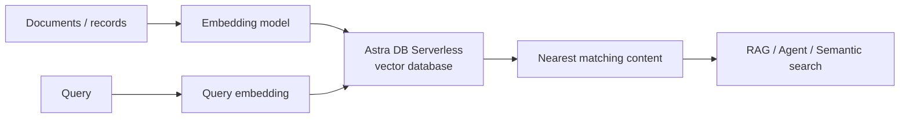

# Serverless Vector

Use **Astra DB Serverless through IBM watsonx.data** for elastic vector storage and similarity search in RAG, semantic search and AI application patterns.

!!! info "Product mapping"
    **IBM watsonx.data + Astra DB Serverless** — add an Astra DB service from the watsonx.data infrastructure experience and provision a **Serverless (vector)** or **Serverless (tables)** database.

!!! example "Existing Building Block"
    A reusable **Astra DB Vector Search Building Block** is available as the implementation reference for this capability.
    **[:octicons-link-external-16: Open the Astra DB Vector Search Building Block](https://ibm-self-serve-assets.github.io/building-blocks-docs/data-core/retrieval/vector-search/datastax-astra-db/)**

    Use the Building Block for implementation guides, demo assets and reusable code. This page documents the capability, business context and architectural guidance.

!!! warning "Building Block vs current product provisioning"
    The existing Astra DB Vector Search Building Block may reflect an earlier integration pattern. Current watsonx.data documentation supports provisioning Astra DB Serverless (vector) **directly from the watsonx.data infrastructure experience**. Clearly distinguish:

    - **Existing Building Block** — a reusable accelerator for Astra DB vector search integration
    - **Current product integration** — Astra DB Serverless provisioned and managed via [IBM watsonx.data](https://www.ibm.com/docs/en/watsonxdata/saas?topic=watsonxdata-adding-astra-db-service)

---

## Why It Matters

Vector search is the retrieval engine behind modern RAG, semantic search and agent memory. Traditional search systems match keywords — vector search matches meaning. Serverless vector databases make this capability available without requiring teams to provision, scale and operate a dedicated vector cluster.

---

## Business Value

!!! success "Key outcomes"
    | Outcome | What It Means |
    |---|---|
    | **Avoid vector-cluster operations** | Serverless capacity scales with application usage — no provisioning or tuning of clusters |
    | **Support RAG and semantic search** | Store embeddings and run approximate nearest-neighbor similarity search at application scale |
    | **Keep vector and application data close** | Astra DB can store vector and non-vector fields together in the same collection |
    | **Faster application development** | Use APIs designed for application access while watsonx.data provides a broader data foundation |
    | **Multi-cloud placement** | Astra DB Serverless supports cloud/region choices, helping place vector data near applications |

---

## When to Use

Use Serverless Vector when:

- You need an **elastic vector store** for RAG, agents, recommendation or semantic search.
- Application teams prefer **API-driven access** over managing a search/vector cluster.
- Workload demand is variable and serverless scaling is attractive.
- You want Astra DB available as a managed service inside the watsonx.data environment.

!!! tip "RAG vs Serverless Vector"
    For agentic enterprise search where OpenRAG capabilities are the primary requirement, use the **[RAG](../rag/index.md)** building block. For vector storage as an application service — especially where teams need direct embedding/query API access — Serverless Vector is often the simpler abstraction.

---

## How Vector Search Works

1. Generate embeddings for content using an embedding model.
2. Store vectors alongside the corresponding records or documents.
3. Generate an embedding for the incoming query.
4. Run similarity search to find the nearest vectors.
5. Return the matching content to the application or RAG pipeline.

---

## What to Demonstrate

1. Add an Astra DB service from watsonx.data.
2. Provision a **Serverless (vector)** database.
3. Create a vector-enabled collection or table.
4. Insert sample records with embeddings or a vectorize integration where supported.
5. Run vector similarity search.
6. Use the results as retrieval context for an AI application.

---

## Design Considerations

!!! tip "Vector database design matters"
    - Use the **same embedding model and dimensions** for indexed content and query vectors.
    - Select the similarity metric appropriate to the embedding model and use case (cosine, dot product, Euclidean).
    - Keep metadata filters alongside vectors when applications need scoped retrieval.
    - Evaluate recall and precision with domain-specific test queries.
    - Design **deletion and re-embedding workflows** for source-content changes.

---

## IBM Products Used

| Product | Role |
|---|---|
| **[IBM watsonx.data — Adding Astra DB](https://www.ibm.com/docs/en/watsonxdata/saas?topic=watsonxdata-adding-astra-db-service)** | Provision and manage Astra DB Serverless from within the watsonx.data infrastructure experience |
| **[Astra DB Serverless](https://docs.datastax.com/en/astra-db-serverless/databases/create-database.html)** | Serverless vector database for embeddings, similarity search, RAG and AI applications |
