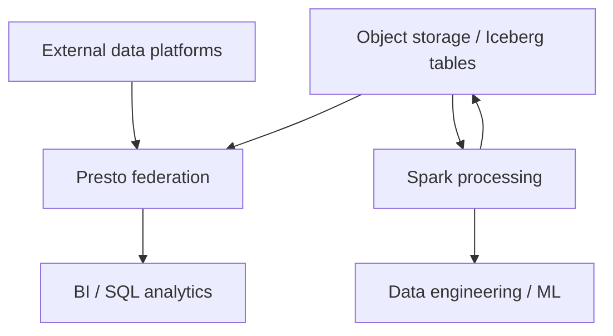

# Zero-Copy Lakehouse

Use **IBM watsonx.data** with **Presto, Spark and Apache Iceberg** to query and process distributed data with less unnecessary copying and to keep analytic data interoperable across engines.

## Business value

- **Reduce duplicated storage:** query supported external platforms without first creating another full copy.
- **Improve freshness:** direct access avoids synchronization delays for use cases where federation is appropriate.
- **Simplify architecture:** remove ETL hops that exist only to make data queryable elsewhere.
- **Use the right engine:** Presto for interactive SQL; Spark for large-scale processing and complex transformations.
- **Preserve interoperability:** Apache Iceberg provides an open table format that multiple engines can work with.

## When to use

Use Zero-Copy Lakehouse when:

- Data already lives in external platforms and copying it adds cost or latency.
- Multiple engines need shared access to open tables.
- Analytics need a combination of interactive SQL and distributed processing.
- Governance policies must be applied consistently across connected data.

Do not assume federation is always faster than local data. For highly repeated, latency-sensitive queries, materialization, caching or ingestion can still be the better design.

## Core roles

### Presto

Use for interactive, SQL-based analytics across connected catalogs and data sources.

### Spark

Use for large-scale data processing, ingestion, cleansing, transformations and complex analytical workloads.

### Apache Iceberg

Use as an open table format for analytic data so different engines can access shared tables with features such as schema evolution and table management.

## Reference architecture

## What to demonstrate

1. Connect a supported external platform or catalog.
2. Query the data with Presto without first copying the entire data set.
3. Run a Spark transformation on a larger workload.
4. Store or manage the result in an Iceberg table.
5. Query the same open table from another engine.

## Design considerations

- Use federation selectively; network latency and source-system concurrency still matter.
- Push predicates and projections to sources where supported to minimize transfer.
- Use Iceberg for shared analytic tables where open-engine interoperability is important.
- Separate interactive and batch workloads so each can use appropriate compute sizing.
- Apply access management and governance consistently across connected catalogs.

## Official references

- [Accessing external data platforms without copying](https://www.ibm.com/docs/en/watsonxdata/saas?topic=components-accessing-data-in-external-data-platforms)
- [IBM watsonx.data Spark](https://www.ibm.com/docs/en/watsonxdata/saas?topic=spark-introduction-watsonxdata)
- [IBM watsonx.data overview](https://www.ibm.com/docs/en/watsonxdata/saas?topic=overview)
