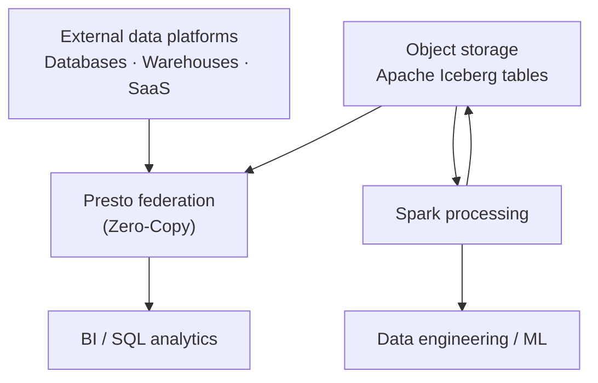

# Zero-Copy Lakehouse

Use **IBM watsonx.data** with **Presto, Spark and Apache Iceberg** to query and process distributed data with less unnecessary copying and to keep analytic data interoperable across engines.

!!! info "Product mapping"
    **IBM watsonx.data** — Presto (interactive SQL) + Apache Spark (large-scale processing) + Apache Iceberg (open table format)

!!! info "GitHub Repository"
    The complete source code and examples are available in the GitHub repository:

    [Building Blocks - Zero-Copy Lakehouse](https://github.com/ibm-self-serve-assets/building-blocks/tree/main/data/retrieval/zero-copy)

---

## Why It Matters

Enterprise data is distributed across dozens of systems — warehouses, object stores, databases, SaaS platforms and legacy environments. Copying all of it into one place is expensive, slow and creates governance headaches. Zero-Copy Lakehouse enables analytics and AI workloads to query data **where it lives**, using the right engine for each workload, with open table formats that let multiple engines share the same governed data.

---

## Business Value

!!! success "Key outcomes"
    | Outcome | What It Means |
    |---|---|
    | **Reduce duplicated storage** | Query supported external platforms without first creating another full copy |
    | **Improve freshness** | Direct access avoids synchronization delays for use cases where federation is appropriate |
    | **Simplify architecture** | Remove ETL hops that exist only to make data queryable elsewhere |
    | **Use the right engine** | Presto for interactive SQL; Spark for large-scale processing and complex transformations |
    | **Preserve interoperability** | Apache Iceberg provides an open table format that multiple engines can work with |

---

## When to Use

Use Zero-Copy Lakehouse when:

- Data already lives in external platforms and copying it adds cost or latency.
- Multiple engines need **shared access to open tables**.
- Analytics need a combination of **interactive SQL and distributed processing**.
- Governance policies must be applied consistently across connected data.

!!! warning "Federation is not always faster"
    For highly repeated, latency-sensitive queries, **materialization, caching or ingestion** can still be the better design. Do not assume federation is always superior to local data.

---

## Core Engine Roles

| Engine | Best For |
|---|---|
| **Presto** | Interactive, SQL-based analytics across connected catalogs and data sources |
| **Spark** | Large-scale data processing, ingestion, cleansing, transformations and complex analytical workloads |
| **Apache Iceberg** | Open table format for analytic data — schema evolution, ACID properties and multi-engine access |

---

## Reference Architecture

---

## What to Demonstrate

1. Connect a supported external platform or catalog.
2. Query the data with Presto **without** first copying the entire data set.
3. Run a Spark transformation on a larger workload.
4. Store or manage the result in an Iceberg table.
5. Query the same open table from another engine.

---

## Design Considerations

!!! tip "Use engines deliberately"
    - Use federation selectively — network latency and source-system concurrency still matter.
    - Push predicates and projections to sources where supported to minimize data transfer.
    - Use Iceberg for shared analytic tables where open-engine interoperability is important.
    - Separate interactive and batch workloads so each can use appropriate compute sizing.
    - Apply access management and governance consistently across all connected catalogs.

---

## IBM Products Used

| Product | Role |
|---|---|
| **[IBM watsonx.data](https://www.ibm.com/products/watsonx-data)** | Unified open lakehouse platform hosting Presto, Spark, Iceberg and external catalog connections |
| **[Accessing external data platforms (Zero-Copy)](https://www.ibm.com/docs/en/watsonxdata/saas?topic=components-accessing-data-in-external-data-platforms)** | Federation capability enabling query-in-place across connected systems |
| **[IBM watsonx.data Spark](https://www.ibm.com/docs/en/watsonxdata/saas?topic=spark-introduction-watsonxdata)** | Managed Spark service for large-scale processing and ML workloads |
