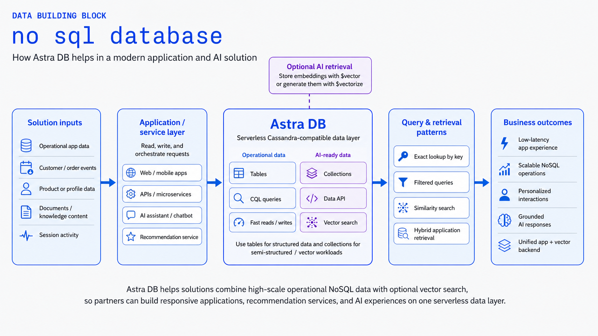
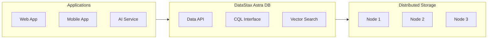

# No SQL Database

Large-scale NoSQL storage with Cassandra compatibility and optional vector capabilities for AI and application workloads.

!!! info "GitHub Repository"
    The complete source code and examples are available in the GitHub repository:
    
    **[Building Blocks - NoSQL Database (Astra DB)](https://github.com/ibm-self-serve-assets/building-blocks/tree/main/data/retrieval/no-sql-database/astradb)**

---

## Overview

The No SQL Database building block provides large-scale NoSQL storage with Cassandra compatibility and optional vector capabilities for AI and application workloads. It is powered by **DataStax Astra DB** — part of the **IBM Cloud HCD (Hyper-Converged Database)** portfolio — offering a serverless, cloud-native database solution that scales automatically based on demand.

---

## IBM Products Used

This building block leverages the following products and services:

- **[IBM HCD / DataStax Astra DB](https://cloud.ibm.com/catalog/services/hyper-converged-database)**: Cloud-native, serverless database built on Apache Cassandra — part of IBM Cloud's Hyper-Converged Database portfolio
- **[Apache Cassandra](https://cassandra.apache.org/)**: Distributed NoSQL database for high availability and scalability
- **[IBM watsonx.data](https://www.ibm.com/products/watsonx-data)**: Integration for unified data access

---

## Features

### Cassandra-Based Architecture

- **Distributed Architecture**: Multi-region, multi-cloud deployment
- **High Availability**: No single point of failure
- **Linear Scalability**: Scale horizontally by adding nodes
- **Tunable Consistency**: Balance between consistency and availability

### Vector Capabilities

- **Vector Collections**: Store and query vector embeddings
- **Similarity Search**: Find similar items based on vector distance
- **AI Integration**: Seamless integration with AI/ML workflows
- **Hybrid Search**: Combine traditional and vector search

### Data API & CQL Support

- **REST API**: HTTP-based Data API for easy integration
- **CQL (Cassandra Query Language)**: SQL-like query language
- **Multiple Client Libraries**: Support for various programming languages
- **GraphQL Support**: Modern API query language

---

## Use Cases

- **AI/ML Applications**: Store embeddings and perform similarity search
- **IoT Data Storage**: Handle high-volume time-series data
- **User Profile Management**: Store and retrieve user data at scale
- **Product Catalogs**: Manage large product inventories
- **Real-Time Analytics**: Process and analyze streaming data

---

## Getting Started

### Prerequisites

!!! info "Requirements"
    1. DataStax Astra DB account (free tier available)
    2. Application credentials (token or username/password)
    3. Client library for your programming language
    4. Network connectivity to Astra DB endpoints

### Basic Setup

1. **Create an Astra DB database**
   - Sign up at [astra.datastax.com](https://astra.datastax.com)
   - Create a new database
   - Generate application token

2. **Connect to your database**
   ```python
   from cassandra.cluster import Cluster
   from cassandra.auth import PlainTextAuthProvider
   
   cloud_config = {
       'secure_connect_bundle': '/path/to/secure-connect-database.zip'
   }
   
   auth_provider = PlainTextAuthProvider('token', 'your-token')
   cluster = Cluster(cloud=cloud_config, auth_provider=auth_provider)
   session = cluster.connect()
   ```

3. **Create a keyspace and table**
   ```sql
   CREATE KEYSPACE IF NOT EXISTS my_keyspace 
   WITH replication = {'class': 'SimpleStrategy', 'replication_factor': 1};
   
   CREATE TABLE my_keyspace.my_table (
       id UUID PRIMARY KEY,
       name TEXT,
       data TEXT
   );
   ```

---

## Architecture Pattern





---

## Vector Search Example

```python
# Create a vector-enabled collection
from astrapy.db import AstraDB

db = AstraDB(
    token="your-token",
    api_endpoint="your-endpoint"
)

collection = db.create_collection(
    collection_name="vector_collection",
    dimension=1536,  # OpenAI embedding dimension
    metric="cosine"
)

# Insert vectors
collection.insert_one({
    "_id": "doc1",
    "text": "Sample document",
    "$vector": [0.1, 0.2, 0.3, ...]  # 1536-dimensional vector
})

# Perform similarity search
results = collection.find(
    sort={"$vector": [0.1, 0.2, 0.3, ...]},
    limit=5
)
```

---

## Best Practices

!!! tip "NoSQL Best Practices"
    - **Data Modeling**: Design tables based on query patterns, not normalization
    - **Partition Keys**: Choose partition keys that distribute data evenly
    - **Consistency Levels**: Select appropriate consistency for your use case
    - **Batch Operations**: Use batch statements for multiple writes
    - **Monitoring**: Track performance metrics and query patterns
    - **Indexing**: Use secondary indexes judiciously

---

## Performance Considerations

- **Partition Size**: Keep partitions under 100MB for optimal performance
- **Query Patterns**: Design tables to support your most common queries
- **Replication Factor**: Balance between availability and write performance
- **Compaction**: Configure compaction strategies based on workload
- **Connection Pooling**: Reuse connections for better performance

---

## Bob Mode

Give IBM Bob a NoSQL / Astra DB specialist persona.

**Install (Windows):**
```powershell
Copy-Item bob-modes/base-modes/astradb-nosql.zip "$env:APPDATA\IBM Bob\User\globalStorage\ibm.bob-code\modes\"
```
**Install (Linux / macOS):**
```bash
cp bob-modes/base-modes/astradb-nosql.zip ~/.config/IBM\ Bob/User/globalStorage/ibm.bob-code/modes/
```

Restart IBM Bob — the Astra DB NoSQL mode appears in the mode selector.

---

## Bob Skills

Teach Bob Astra DB NoSQL and vector patterns. Extract the zip into your Bob workspace `.bob/skills/` directory:

```bash
unzip bob-skills/astradb-nosql.zip
```

Open IBM Bob → Skills panel → enable the skill.

---

## Resources

- [GitHub Repository](https://github.com/ibm-self-serve-assets/building-blocks/tree/main/data/retrieval/no-sql-database/astradb)
- [IBM HCD / DataStax Astra DB on IBM Cloud](https://cloud.ibm.com/catalog/services/hyper-converged-database)
- [DataStax Astra DB Documentation](https://docs.datastax.com/en/astra/home/astra.html)
- [Apache Cassandra Documentation](https://cassandra.apache.org/doc/latest/)
- [Vector Search Guide](https://docs.datastax.com/en/astra/astra-db-vector/get-started/quickstart.html)

---

## Support

For issues or questions, please refer to the [GitHub repository](https://github.com/ibm-self-serve-assets/building-blocks/tree/main/data/retrieval/no-sql-database) or contact DataStax support.