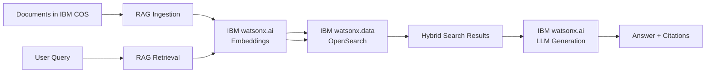

# RAG (Retrieval-Augmented Generation)

Complete end-to-end RAG pipeline — ingest documents from **IBM Cloud Object Storage**, generate dense embeddings with **IBM watsonx.ai**, store in **IBM watsonx.data OpenSearch**, and serve hybrid search (vector + BM25 keyword) and Q&A queries via REST API or MCP server.

!!! info "GitHub Repository"
    The complete source code and examples are available in the GitHub repository:
    
    **[Building Blocks - RAG](https://github.com/ibm-self-serve-assets/building-blocks/tree/main/data/retrieval/RAG)**

---

## Overview

The RAG building block provides a complete pipeline for implementing Retrieval-Augmented Generation systems. It handles document processing, embedding generation with IBM watsonx.ai, vector storage in IBM watsonx.data OpenSearch, and hybrid semantic + keyword search — enabling AI applications to retrieve relevant information from large document collections.

> **AI-tool agnostic**: MCP servers work with **IBM Bob**, **Claude**, and other MCP-compatible AI assistants.

---

## When to Use

| Scenario | Asset |
|---|---|
| Need a full-featured RAG service with `/ingest`, `/query`, and `/qna` REST endpoints | [`rag-accelerator`](https://github.com/ibm-self-serve-assets/building-blocks/tree/main/data/retrieval/RAG/assets/rag-accelerator) |
| Need an AI assistant (Bob, Claude) to trigger ingestion via MCP tools | [`rag-ingestion-sse-mcp-server`](https://github.com/ibm-self-serve-assets/building-blocks/tree/main/data/retrieval/RAG/assets/rag-ingestion-sse-mcp-server) |
| Need an AI assistant (Bob, Claude) to query the knowledge base via MCP tools | [`rag-retrieval-sse-mcp-server`](https://github.com/ibm-self-serve-assets/building-blocks/tree/main/data/retrieval/RAG/assets/rag-retrieval-sse-mcp-server) |
| Need a lightweight REST retrieval API to pair with your own ingestion pipeline | [`rag-retrieval-fastapi-server`](https://github.com/ibm-self-serve-assets/building-blocks/tree/main/data/retrieval/RAG/assets/rag-retrieval-fastapi-server) |

---

## Assets

### [RAG Accelerator](https://github.com/ibm-self-serve-assets/building-blocks/tree/main/data/retrieval/RAG/assets/rag-accelerator)

Full-featured FastAPI RAG service — ingest documents from IBM COS, generate IBM watsonx.ai embeddings, index vectors in OpenSearch, and expose REST endpoints.

**API Endpoints:**

| Method | Path | Description |
|---|---|---|
| `POST` | `/ingest` | Ingest documents from IBM COS into OpenSearch |
| `POST` | `/query` | Hybrid search — returns top-K chunks (vector + BM25) |
| `POST` | `/qna` | RAG Q&A — retrieves context, generates answer with watsonx.ai |
| `GET`  | `/index_management/indices` | List all indexes |
| `POST` | `/index_management/create` | Create a new index |
| `DELETE` | `/index_management/delete` | Drop an index |

**Quick Start:**
```bash
cd assets/rag-accelerator
cp .env.example .env
# Edit .env: IBM_API_KEY, WATSONX_PROJECT_ID, OPENSEARCH_* credentials, COS_ENDPOINT
pip install -r requirements.txt
python main.py
# Swagger UI → http://localhost:8080/docs
```

---

### [RAG Ingestion MCP Server](https://github.com/ibm-self-serve-assets/building-blocks/tree/main/data/retrieval/RAG/assets/rag-ingestion-sse-mcp-server)

MCP server (SSE transport) that exposes ingestion tools — `ingest_from_cos`, `list_indexed_documents`, `delete_document` — so AI assistants (IBM Bob, Claude) can trigger RAG ingestion without a REST client.

**Quick Start:**
```bash
cd assets/rag-ingestion-sse-mcp-server
cp .env.example .env
# Edit .env: IBM_API_KEY, WATSONX_PROJECT_ID, OPENSEARCH_* and COS_* vars
pip install -r app/requirements.txt
uvicorn app.server:app --host 0.0.0.0 --port 8080
# MCP endpoint → http://localhost:8080/mcp
```

---

### [RAG Retrieval MCP Server](https://github.com/ibm-self-serve-assets/building-blocks/tree/main/data/retrieval/RAG/assets/rag-retrieval-sse-mcp-server)

MCP server (SSE transport) that exposes retrieval tools — `search_documents`, `keyword_search`, `ask_question` — enabling AI assistants to query the OpenSearch index and perform RAG Q&A.

---

### [RAG Retrieval FastAPI Server](https://github.com/ibm-self-serve-assets/building-blocks/tree/main/data/retrieval/RAG/assets/rag-retrieval-fastapi-server)

Lightweight FastAPI server focused exclusively on retrieval. Designed to pair with the RAG Accelerator or the MCP ingestion server.

**API Endpoints:**

| Method | Path | Description |
|---|---|---|
| `POST` | `/retrieve` | Hybrid search — returns top-K chunks (vector + BM25) |
| `POST` | `/keyword_search` | BM25 keyword-only search |
| `GET`  | `/health` | Server health and configuration status |

---

## Bob Modes

Three focused Bob modes covering the full RAG lifecycle. Install by copying the zip to your Bob modes directory.

| Mode | Zip | Use When |
|---|---|---|
| **RAG Builder** | [`rag-builder.zip`](https://github.com/ibm-self-serve-assets/building-blocks/tree/main/data/retrieval/RAG/bob-modes/base-modes/rag-builder.zip) | Designing or building a complete RAG system end-to-end |
| **RAG Ingestion Builder** | [`rag-ingestion.zip`](https://github.com/ibm-self-serve-assets/building-blocks/tree/main/data/retrieval/RAG/bob-modes/base-modes/rag-ingestion.zip) | Building or debugging document ingestion from IBM COS |
| **RAG Retrieval Builder** | [`rag-retrieval.zip`](https://github.com/ibm-self-serve-assets/building-blocks/tree/main/data/retrieval/RAG/bob-modes/base-modes/rag-retrieval.zip) | Tuning search quality or building the Q&A layer |

**Install (Windows):**
```powershell
Copy-Item bob-modes/base-modes/rag-builder.zip "$env:APPDATA\IBM Bob\User\globalStorage\ibm.bob-code\modes\"
Copy-Item bob-modes/base-modes/rag-ingestion.zip "$env:APPDATA\IBM Bob\User\globalStorage\ibm.bob-code\modes\"
Copy-Item bob-modes/base-modes/rag-retrieval.zip "$env:APPDATA\IBM Bob\User\globalStorage\ibm.bob-code\modes\"
```

**Install (Linux / macOS):**
```bash
cp bob-modes/base-modes/rag-builder.zip ~/.config/IBM\ Bob/User/globalStorage/ibm.bob-code/modes/
cp bob-modes/base-modes/rag-ingestion.zip ~/.config/IBM\ Bob/User/globalStorage/ibm.bob-code/modes/
cp bob-modes/base-modes/rag-retrieval.zip ~/.config/IBM\ Bob/User/globalStorage/ibm.bob-code/modes/
```

---

## Bob Skills

Install by extracting the zip into your Bob workspace `.bob/skills/` directory.

| Skill | Zip | Capabilities |
|---|---|---|
| `rag-pipeline-builder` | [`rag-pipeline-builder.zip`](https://github.com/ibm-self-serve-assets/building-blocks/tree/main/data/retrieval/RAG/bob-skills/rag-pipeline-builder.zip) | Complete RAG pipeline design, IBM watsonx.ai embedding integration, OpenSearch HNSW + hybrid search design, chunking strategy selection, FastAPI service patterns |
| `rag-mcp-server-builder` | [`rag-mcp-server-builder.zip`](https://github.com/ibm-self-serve-assets/building-blocks/tree/main/data/retrieval/RAG/bob-skills/rag-mcp-server-builder.zip) | MCP server development (SSE transport, FastMCP), RAG ingestion + retrieval tool design, IBM Bob / Claude integration, deployment to IBM Code Engine |

```bash
# From the root of your Bob workspace project
unzip bob-skills/rag-pipeline-builder.zip
unzip bob-skills/rag-mcp-server-builder.zip
```

---

## Embedding Models

| Model ID | Dimension | Language | Use Case |
|---|---|---|---|
| `ibm/slate-125m-english-rtrvr` | 768 | English | Recommended for English RAG |
| `ibm/slate-30m-english-rtrvr` | 384 | English | Lightweight English RAG |
| `intfloat/multilingual-e5-large` | 1024 | Multi | Multilingual RAG |

---

## Search Mode Comparison

| Feature | Hybrid Search (recommended) | Vector-only |
|---|---|---|
| Index type | HNSW (cosine) + BM25 | HNSW (cosine) |
| Retrieval quality | ✅ Best — catches semantic + exact matches | ⚠️ Misses keyword-specific queries |
| IBM deployment | IBM watsonx.data managed OpenSearch | IBM watsonx.data managed OpenSearch |

---

## Architecture



---

## IBM Products Used

- **IBM watsonx.ai** — Embedding generation (`ibm/slate-125m-english-rtrvr`) and LLM generation (Granite)
- **IBM watsonx.data (OpenSearch)** — Managed OpenSearch for k-NN HNSW + BM25 hybrid search
- **IBM Cloud Object Storage (COS)** — Document storage and ingestion source
- **IBM Cloud IAM** — API key authentication

---

## Prerequisites

- **IBM Cloud API key** — [create at IBM Cloud IAM](https://cloud.ibm.com/iam/apikeys)
- **Python 3.10+**
- **IBM watsonx.ai** project — note your Project ID and instance URL
- **IBM watsonx.data OpenSearch** instance — note host, port, username, and password
- **IBM Cloud Object Storage** bucket — note endpoint, instance CRN, and bucket name

---

## Use Cases

!!! example "Common RAG Applications"

    **Question Answering** — Build intelligent Q&A systems over your documents
    
    **Semantic Search** — Find relevant information based on meaning, not just keywords
    
    **Document Analysis** — Extract insights from large document collections
    
    **Knowledge Management** — Create searchable knowledge bases from unstructured data
    
    **AI Assistant Integration** — Add RAG capabilities to AI coding assistants via MCP
    
    **Hybrid Search** — Combine semantic understanding with keyword precision

---

## Resources

- [GitHub Repository - RAG Building Block](https://github.com/ibm-self-serve-assets/building-blocks/tree/main/data/retrieval/RAG)
- [IBM watsonx.ai Documentation](https://www.ibm.com/docs/en/watsonx-as-a-service)
- [IBM watsonx.data Documentation](https://cloud.ibm.com/docs/watsonxdata)
- [OpenSearch k-NN Plugin](https://opensearch.org/docs/latest/search-plugins/knn/)
- [Model Context Protocol (MCP)](https://modelcontextprotocol.io/docs)

---

## Support

For issues or questions, please refer to the [GitHub repository](https://github.com/ibm-self-serve-assets/building-blocks/tree/main/data/retrieval/RAG) or contact IBM support.
