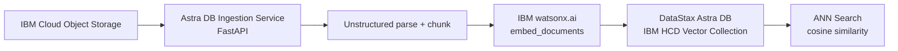

# DataStax Astra DB Vector Search

Build vector search applications using **DataStax Astra DB** — part of the **IBM Cloud HCD (Hyper-Converged Database)** portfolio — with **IBM watsonx.ai** embeddings. Ingest documents from **IBM COS**, generate dense embeddings, store in Astra DB vector collections, and perform ANN search with cosine similarity.

!!! info "GitHub Repository"
    The complete source code and examples are available in the GitHub repository:
    
    **[Building Blocks - Vector Search / DataStax Astra DB](https://github.com/ibm-self-serve-assets/building-blocks/tree/main/data/retrieval/vector-search/datastax-astradb)**

---

## Overview

This building block provides a standalone FastAPI ingestion service for **IBM HCD (DataStax Astra DB)**. Documents are downloaded from IBM COS, parsed into chunks, embedded with IBM watsonx.ai, and inserted into Astra DB vector collections using the `astrapy` Data API. Queries use ANN cosine similarity search over the `$vector` field.

---

## When to Use

| Scenario | Notes |
|---|---|
| Need vector search on IBM HCD (Astra DB) rather than OpenSearch | Use this block — Astra DB uses `$vector` field + ANN cosine search |
| Ingest documents from IBM COS and search them semantically | Start with `astradb-vector-ingestion` FastAPI asset |
| Want globally distributed, serverless vector storage | Astra DB is serverless — scales automatically |
| Need both NoSQL document storage and vector search in one service | Combine this with [No SQL Database](../no-sql-database/index.md) |

> **OpenSearch vs Astra DB for RAG**: Use **[OpenSearch](opensearch.md)** if you need hybrid search (vector + BM25 keyword). Use **Astra DB** if you specifically need IBM HCD serverless Cassandra-backed vector storage.

---

## Asset — Astra DB Vector Ingestion Service

**Location**: [`assets/astradb-vector-ingestion/`](https://github.com/ibm-self-serve-assets/building-blocks/tree/main/data/retrieval/vector-search/datastax-astradb/assets/astradb-vector-ingestion)
**IBM Products**: IBM HCD (Astra DB), IBM watsonx.ai, IBM COS, IBM Cloud IAM

FastAPI service that downloads documents from IBM COS, generates IBM watsonx.ai embeddings, and inserts them into Astra DB vector collections using the `astrapy` Data API.

**Quick Start:**
```bash
cd assets/astradb-vector-ingestion
cp .env.example .env
# Edit .env:
#   IBM_API_KEY                   — your IBM Cloud API key
#   WATSONX_PROJECT_ID            — your watsonx.ai project ID
#   ASTRA_DB_API_ENDPOINT         — from Astra DB console → Connect
#   ASTRA_DB_APPLICATION_TOKEN    — AstraCS:... token
pip install -r requirements.txt
python main.py
# Swagger UI → http://localhost:8080/docs
```

**Ingest documents from COS:**
```bash
curl -X POST http://localhost:8080/ingest \
  -H "REST_API_KEY: your_key" \
  -H "Content-Type: application/json" \
  -d '{
    "bucket_name": "my-docs-bucket",
    "directory": "documents/",
    "collection_name": "ibm_docs_vectors",
    "embedding_model_id": "ibm/slate-125m-english-rtrvr"
  }'
```

---

## Bob Mode

Give IBM Bob an Astra DB Vector specialist persona.

**Install (Windows):**
```powershell
Copy-Item bob-modes/base-modes/astradb-vector-builder.zip "$env:APPDATA\IBM Bob\User\globalStorage\ibm.bob-code\modes\"
```
**Install (Linux / macOS):**
```bash
cp bob-modes/base-modes/astradb-vector-builder.zip ~/.config/IBM\ Bob/User/globalStorage/ibm.bob-code/modes/
```

Restart IBM Bob — **Astra DB Vector Builder** mode appears in the mode selector.

---

## Bob Skill

| Skill | Zip | Capabilities |
|---|---|---|
| `astradb-vector-setup` | [`astradb-vector-setup.zip`](https://github.com/ibm-self-serve-assets/building-blocks/tree/main/data/retrieval/vector-search/datastax-astradb/bob-skills/astradb-vector-setup.zip) | Astra DB vector collection creation, IBM watsonx.ai embedding integration, ANN search queries (`astrapy`), IBM COS ingestion patterns |

```bash
# From the root of your Bob workspace project
unzip bob-skills/astradb-vector-setup.zip
```

Open IBM Bob → Skills panel → enable `astradb-vector-setup`.

---

## Vector Collection Design

```python
from astrapy.db import AstraDB

db = AstraDB(
    token="your-AstraCS-token",
    api_endpoint="your-api-endpoint"
)

# Create a vector-enabled collection (768-dim for IBM slate model)
collection = db.create_collection(
    collection_name="ibm_docs_vectors",
    dimension=768,
    metric="cosine"
)

# Insert a document with its embedding
collection.insert_one({
    "_id": "doc1",
    "text": "IBM watsonx.data is an open lakehouse platform.",
    "$vector": [0.01, 0.22, ...]  # 768-dimensional vector
})

# Perform ANN similarity search
results = collection.find(
    sort={"$vector": query_embedding},
    limit=5
)
```

---

## Architecture



---

## IBM Products Used

- **IBM HCD / DataStax Astra DB** — Serverless Cassandra-backed vector storage
- **IBM watsonx.ai** — Embedding generation (`ibm/slate-125m-english-rtrvr`)
- **IBM Cloud Object Storage (COS)** — Document source storage
- **IBM Cloud IAM** — API key authentication

---

## Embedding Models

| Model ID | Dimension | Language | Use Case |
|---|---|---|---|
| `ibm/slate-125m-english-rtrvr` | 768 | English | Recommended for English RAG |
| `ibm/slate-30m-english-rtrvr` | 384 | English | Lightweight English RAG |
| `intfloat/multilingual-e5-large` | 1024 | Multi | Multilingual RAG |

---

## Use Cases

- **Semantic Search** — Find documents based on meaning using ANN cosine similarity
- **RAG Pipelines** — Retrieval layer backed by IBM HCD serverless storage
- **Global Applications** — Multi-region deployment with Cassandra replication
- **AI Backends** — Store embeddings alongside application data

---

## Resources

- [GitHub Repository](https://github.com/ibm-self-serve-assets/building-blocks/tree/main/data/retrieval/vector-search/datastax-astradb)
- [IBM HCD / DataStax Astra DB on IBM Cloud](https://cloud.ibm.com/catalog/services/hyper-converged-database)
- [DataStax Astra DB Data API](https://docs.datastax.com/en/astra/astra-db-vector/api-reference/data-api.html)
- [astrapy SDK Documentation](https://github.com/datastax/astrapy)
- [IBM watsonx.ai Embedding Models](https://dataplatform.cloud.ibm.com/docs/content/wsj/analyze-data/fm-models-embed.html)

---

## Support

For issues or questions, please refer to the [GitHub repository](https://github.com/ibm-self-serve-assets/building-blocks/tree/main/data/retrieval/vector-search/datastax-astradb) or open an issue.
