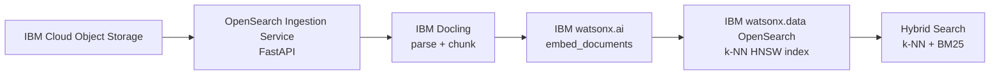

# OpenSearch Hybrid Search

Build high-performance **hybrid search** applications using **IBM watsonx.data OpenSearch** with **IBM watsonx.ai** embeddings. Ingest documents from **IBM Cloud Object Storage**, generate dense embeddings, store in k-NN vector indexes, and perform hybrid (vector + BM25) search for best retrieval accuracy.

!!! info "GitHub Repository"
    The complete source code and examples are available in the GitHub repository:
    
    **[Building Blocks - Vector Search / OpenSearch](https://github.com/ibm-self-serve-assets/building-blocks/tree/main/data/retrieval/vector-search/opensearch)**

---

## Overview

This building block provides a standalone FastAPI ingestion and search service backed by **IBM watsonx.data managed OpenSearch**. It uses the OpenSearch k-NN plugin with HNSW indexes for vector search, combined with BM25 keyword search — delivering hybrid retrieval that outperforms pure vector-only approaches.

> **Hybrid Search vs Vector-only**: Always use hybrid search (k-NN + BM25) in production — it consistently outperforms pure vector search by catching both semantic paraphrase matches and exact keyword matches.

---

## When to Use

| Scenario | Notes |
|---|---|
| Need a standalone ingestion + search service for documents stored in IBM COS | Start with `opensearch-data-ingestion` FastAPI asset |
| Want the best retrieval accuracy for a RAG pipeline | Use **hybrid search** (k-NN + BM25) — outperforms vector-only |
| Need to integrate with an existing RAG accelerator | Index documents here, point `rag-retrieval-fastapi-server` at the same index |
| Need to tune HNSW index parameters (`ef_construction`, `m`) | Use the `opensearch-vector-search` Bob Skill |

---

## Asset — OpenSearch Data Ingestion Service

**Location**: [`assets/opensearch-data-ingestion/`](https://github.com/ibm-self-serve-assets/building-blocks/tree/main/data/retrieval/vector-search/opensearch/assets/opensearch-data-ingestion)
**IBM Products**: IBM watsonx.data (OpenSearch), IBM watsonx.ai, IBM COS, IBM Cloud IAM

FastAPI service that downloads documents from IBM COS, generates IBM watsonx.ai embeddings, creates k-NN HNSW indexes in IBM watsonx.data OpenSearch, and bulk-inserts document vectors.

**Quick Start:**
```bash
cd assets/opensearch-data-ingestion
cp .env.example .env
# Edit .env:
#   IBM_API_KEY              — your IBM Cloud API key
#   WATSONX_PROJECT_ID       — your watsonx.ai project ID
#   OPENSEARCH_HOST          — OpenSearch host (from watsonx.data console)
#   OPENSEARCH_USERNAME      — OpenSearch username
#   OPENSEARCH_PASSWORD      — OpenSearch password
#   COS_ENDPOINT             — IBM COS endpoint
#   COS_BUCKET_NAME          — source bucket name
pip install -r requirements.txt
python main.py
# Swagger UI → http://localhost:8080/docs
```

**Ingest documents from COS:**
```bash
curl -X POST http://localhost:8080/ingest \
  -H "REST_API_KEY: your_key" \
  -H "Content-Type: application/json" \
  -d '{
    "bucket_name": "my-docs-bucket",
    "directory": "documents/",
    "index_name": "product_knowledge_base",
    "embedding_model_id": "ibm/slate-125m-english-rtrvr"
  }'
```

**Hybrid search:**
```bash
curl -X POST http://localhost:8080/search \
  -H "REST_API_KEY: your_key" \
  -H "Content-Type: application/json" \
  -d '{"query": "What is IBM watsonx?", "k": 5, "search_type": "hybrid"}'
```

---

## Bob Mode

Give IBM Bob an OpenSearch hybrid search specialist persona.

**Install (Windows):**
```powershell
Copy-Item bob-modes/base-modes/opensearch-builder.zip "$env:APPDATA\IBM Bob\User\globalStorage\ibm.bob-code\modes\"
```
**Install (Linux / macOS):**
```bash
cp bob-modes/base-modes/opensearch-builder.zip ~/.config/IBM\ Bob/User/globalStorage/ibm.bob-code/modes/
```

Restart IBM Bob — **OpenSearch Builder** mode appears in the mode selector.

---

## Bob Skill

| Skill | Zip | Capabilities |
|---|---|---|
| `opensearch-vector-search` | [`opensearch-vector-search.zip`](https://github.com/ibm-self-serve-assets/building-blocks/tree/main/data/retrieval/vector-search/opensearch/bob-skills/opensearch-vector-search.zip) | IBM watsonx.data OpenSearch k-NN index design, HNSW parameter tuning, hybrid search (vector + BM25), watsonx.ai embedding integration |

```bash
# From the root of your Bob workspace project
unzip bob-skills/opensearch-vector-search.zip
```

Open IBM Bob → Skills panel → enable `opensearch-vector-search`.

---

## k-NN Index Configuration

```json
{
  "settings": {"index": {"knn": true}},
  "mappings": {
    "properties": {
      "vector": {
        "type": "knn_vector",
        "dimension": 768,
        "method": {
          "name": "hnsw",
          "space_type": "l2",
          "engine": "nmslib",
          "parameters": {"ef_construction": 128, "m": 24}
        }
      }
    }
  }
}
```

---

## Embedding Models

| Model ID | Dimension | Language | Use Case |
|---|---|---|---|
| `ibm/slate-125m-english-rtrvr` | 768 | English | Recommended for English RAG |
| `ibm/slate-30m-english-rtrvr` | 384 | English | Lightweight English RAG |
| `intfloat/multilingual-e5-large` | 1024 | Multi | Multilingual RAG |

---

## Architecture



---

## IBM Products Used

- **IBM watsonx.data (OpenSearch)** — Managed OpenSearch for k-NN HNSW + BM25 hybrid search
- **IBM watsonx.ai** — Embedding generation (`ibm/slate-125m-english-rtrvr`)
- **IBM Cloud Object Storage (COS)** — Document source storage
- **IBM Cloud IAM** — API key authentication

---

## Use Cases

- **Semantic Search** — Find documents based on meaning, not just keywords
- **RAG Pipelines** — Retrieval-augmented generation for LLMs
- **Hybrid Search** — Combine semantic understanding with keyword precision
- **Knowledge Bases** — Build searchable knowledge repositories
- **Question Answering** — Retrieve relevant context for Q&A systems

---

## Resources

- [GitHub Repository](https://github.com/ibm-self-serve-assets/building-blocks/tree/main/data/retrieval/vector-search/opensearch)
- [IBM watsonx.data Documentation](https://cloud.ibm.com/docs/watsonxdata)
- [IBM watsonx.ai Embedding Models](https://dataplatform.cloud.ibm.com/docs/content/wsj/analyze-data/fm-models-embed.html)
- [OpenSearch k-NN Plugin](https://opensearch.org/docs/latest/search-plugins/knn/)
- [IBM Cloud IAM API Keys](https://cloud.ibm.com/iam/apikeys)

---

## Support

For issues or questions, please refer to the [GitHub repository](https://github.com/ibm-self-serve-assets/building-blocks/tree/main/data/retrieval/vector-search/opensearch) or open an issue.
