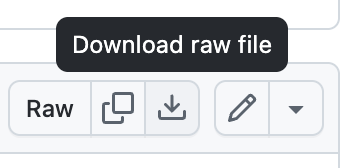

<link rel="stylesheet" href="./skills.css">

# Skills for the Bob+ IBM Technology Building Blocks

This collection of [Skills for IBM Bob](https://bob.ibm.com/docs/ide/features/skills) provides IBM Bob with the expertise to quickly build applications using the [Bob+ IBM Technology Building Blocks](../../index.md).   Each skill focuses on a specific Building Block and contains task-specific instructions, code patterns, examples and constraints Bob should follow when doing engineering work.

 The Building Blocks are a community effort.  Learn more about [contributing your Skills for Bob+ IBM Technology Building Blocks.](contributing_to_skills.md)

## How to install the Skills
The Skills have been packed into a single .zip that you can easily download and install. Go to the [skills.zip page](https://github.com/ibm-self-serve-assets/building-blocks/blob/main/ibm-bob/skills.zip) and click the `Download raw file` icon at the upper-right of the page.  Copy all skill folders at either the global, `~/.bob/skills`, or project-level, `<project>/.bob/skills`
  

## Skill Taxonomy

Each Skill for IBM Building Blocks often aligns with an IBM product but not always.  For specifics on how each skill works, read through the associated SKILL.md.  

  <table class="skill-card" style="--accent:#6adada; --header:#e8fbfb; --th:#d7f7f7; --first-td:#f0fdfd; --grid:#b8eeee; --text:#021f1f;">
    <tbody>
      <thead><tr><th colspan="2">
        
AI Skills

      </th></tr></thead>
      <tr>
        <td>
Agents
</td>
        <td>
            <a href="https://github.com/ibm-self-serve-assets/building-blocks/blob/main/ibm-bob/skills/agent">Agent Skills</a>
             Build and deploy enterprise-ready AI agents that automate business workflows, orchestrate complex tasks, and accelerate software development through intelligent automation.
        </td>
      </tr>
      <tr>
        <td>
AI Trust
</td>
        <td>
            
<a href="https://github.com/ibm-self-serve-assets/building-blocks/tree/main/ibm-bob/skills/real-time-guardrails">Real-Time Guardrails</a>
             Add runtime safety and quality guardrails to Gen AI, RAG agents, and watsonx Orchestrate tools using watsonx.governance, Pass/Flag/Block at input, retrieval, generation, and output.

            
<a href="https://github.com/ibm-self-serve-assets/building-blocks/tree/main/ibm-bob/skills/agent-ops">Agent Ops</a>
             Plan and run evaluations, red-teaming, and runtime observability for watsonx Orchestrate agents across Developer Edition and SaaS — benchmark authoring, metric diagnosis, attack catalog, traces, Langfuse cost analysis.

            
<a href="https://github.com/ibm-self-serve-assets/building-blocks/tree/main/ibm-bob/skills/build-time-gen-ai-evals">Model Evaluation</a>
             Evaluate GenAI models and applications — prompts, RAG pipelines, LLM outputs, agentic tool-calling — using watsonx.governance metrics.

        </td>
      </tr>
    </tbody>
  </table>

  <table class="skill-card" style="--accent:#aacaff; --header:#edf4ff; --th:#dfeaff; --first-td:#f3f7ff; --grid:#c9dcff; --text:#031040;">
    <tbody>
      <thead><tr><th colspan="2">
        
Data Skills

      </th></tr></thead>
      <tr>
        <td>
Integration
</td>
        <td>
            
<a href="https://github.com/ibm-self-serve-assets/building-blocks/tree/main/ibm-bob/skills/data-streaming-confluent">Data-streaming: Confluent</a>
             Works with the Confluent Platform for real-time data streaming, Kafka topic management, stream processing configuration, and data pipeline setup for event-driven architectures.

            
<a href="https://github.com/ibm-self-serve-assets/building-blocks/blob/main/ibm-bob/skills/data-streaming-confluent-terraform/SKILL.md">Data-streaming: Confluent plus Terraform</a>
             Expert guidance for building real-time streaming systems on Confluent Cloud using Infrastructure-as-Code (Terraform), Apache Flink SQL, and Python producers. Adapts to any streaming use case (IoT, finance, retail, healthcare, logistics) while maintaining production-ready quality.

            
<a href="https://github.com/ibm-self-serve-assets/building-blocks/tree/main/data/integration/data-pipeline-ai-generated/bob-skills">Data Ingestion: Structured</a>
             IBM DataStage connector config, CDC pipeline design, schema mapping, DB2/PostgreSQL/MySQL/Oracle patterns, batch and incremental load strategies into IBM watsonx.data.

            
<a href="https://github.com/ibm-self-serve-assets/building-blocks/tree/main/data/integration/data-pipeline-ai-generated/bob-skills">Data Ingestion: Unstructured</a>
             IBM Docling document parsing, UDI pipeline configuration, IBM COS ingestion, multi-format chunking (PDF, DOCX, HTML, images), metadata extraction, Python 3.12 automation scripts.

            
<a href="https://github.com/ibm-self-serve-assets/building-blocks/tree/main/data/integration/data-pipeline-ai-generated/bob-skills">Data Ingestion: UDI + OpenSearch</a>
             IBM UDI + OpenSearch integration, document search pipeline setup, OpenSearch index provisioning for UDI output into IBM watsonx.data.

            
<a href="https://github.com/ibm-self-serve-assets/building-blocks/tree/main/data/integration/data-observability/bob-skills">Data Observability: Databand Pipeline Setup</a>
             IBM Databand pipeline onboarding, OpenLineage event design (START / COMPLETE / FAIL), alert policy authoring (null-rate, schema-drift, SLA-breach), IBM IAM auth patterns.

        </td>
      </tr>
      <tr>
        <td>
Intelligence
</td>
        <td>
            
<a href="https://github.com/ibm-self-serve-assets/building-blocks/tree/main/data/intelligence/text2sql/bob-skills">Text2SQL: Metadata Enrichment</a>
             watsonx.data Intelligence project onboarding, table/column description enrichment, synonym design, query example authoring, accuracy measurement. Maximises Text2SQL query accuracy.

            
<a href="https://github.com/ibm-self-serve-assets/building-blocks/tree/main/data/intelligence/text2sql/bob-skills">Text2SQL: Query Optimizer</a>
             Model selection (Granite vs Llama), SQL safety validation, accuracy evaluation (exact-match + execution accuracy), error pattern diagnosis, SQL dialect tuning (Presto, PostgreSQL, Oracle, Snowflake).

            
<a href="https://github.com/ibm-self-serve-assets/building-blocks/tree/main/data/intelligence/data-lineage/bob-skills">Data Lineage: OpenLineage Instrumentation</a>
             OpenLineage event design, Python/DataStage/Spark instrumentation patterns, IBM Databand lineage API integration, lineage graph authoring for end-to-end data traceability.

            
<a href="https://github.com/ibm-self-serve-assets/building-blocks/tree/main/data/intelligence/data-quality/bob-skills">Data Quality: Rules</a>
             Data quality rule authoring, watsonx.data Intelligence quality checks, profiling automation, threshold design, compliance reporting patterns for AI-ready data.

        </td>
      </tr>
      <tr>
        <td>
Retrieval
</td>
        <td>
            
<a href="https://github.com/ibm-self-serve-assets/building-blocks/tree/main/data/retrieval/RAG/bob-skills">RAG Pipeline Builder</a>
             Complete RAG pipeline design — IBM watsonx.ai embedding integration, OpenSearch HNSW + hybrid search design, chunking strategy selection, FastAPI service patterns, RAG evaluation with RAGAS metrics.

            
<a href="https://github.com/ibm-self-serve-assets/building-blocks/tree/main/data/retrieval/RAG/bob-skills">RAG MCP Server Builder</a>
             MCP server development (SSE transport, FastMCP), RAG ingestion + retrieval tool design (`ingest_from_cos`, `search_documents`, `ask_question`), IBM Bob / Claude integration, deployment to IBM Code Engine.

            
<a href="https://github.com/ibm-self-serve-assets/building-blocks/tree/main/data/retrieval/vector-search/opensearch/bob-skills">Vector Search: OpenSearch</a>
             IBM watsonx.data OpenSearch k-NN index design, HNSW parameter tuning (`ef_construction`, `m`), hybrid search (vector + BM25) score fusion, IBM watsonx.ai embedding integration.

            
<a href="https://github.com/ibm-self-serve-assets/building-blocks/tree/main/data/retrieval/vector-search/datastax-astradb/bob-skills">Vector Search: AstraDB</a>
             Astra DB vector collection creation, IBM watsonx.ai embedding integration, ANN cosine search queries via `astrapy` Data API, IBM COS ingestion patterns for IBM HCD.

        </td>
      </tr>
    </tbody>
  </table>

  <table class="skill-card" style="--accent:#d5acff; --header:#f7efff; --th:#eedcff; --first-td:#fbf6ff; --grid:#e4c9ff; --text:#160040;">
    <tbody>
      <thead><tr><th colspan="2">
        
Automation Skills

      </th></tr></thead>
      <tr>
        <td>
Build
</td>
        <td>
            
<a href="https://github.com/ibm-self-serve-assets/building-blocks/blob/main/ibm-bob/skills/ibm-cloud/SKILL.md">Using the IBM Cloud CLI; ibmcloud</a>
             Work with IBM Cloud by using the stand-alone `ibmcloud` CLI or IBM Cloud Shell.

            
<a href="https://github.com/ibm-self-serve-assets/building-blocks/blob/main/ibm-bob/skills/infrastructure-as-code-ansible/SKILL.md">Infrastructure-as-code: Ansible</a>
             Use for any Ansible-related tasks including playbook development, shell script conversion, debugging failures, or interactive setup. This is the parent skill that provides access to specialized Ansible workflows.

            
<a href="https://github.com/ibm-self-serve-assets/building-blocks/blob/main/ibm-bob/skills/infrastructure-as-code-terraform/SKILL.md">Infrastructure-as-code: Terraform</a>
             Use when writing, reviewing, or debugging Terraform/OpenTofu modules, tests, CI/CD pipelines, or state operations. Diagnoses failure modes (identity churn, secrets, blast radius, CI drift, state corruption) with version-aware guidance.

            
<a href="https://github.com/ibm-self-serve-assets/building-blocks/blob/main/ibm-bob/skills/code-modernization-expert/SKILL.md">Code Modernization Expert</a>
             Modernize legacy code using enterprise patterns, automated refactoring, technical debt analysis, and incremental migration with zero downtime.

            
<a href="https://github.com/ibm-self-serve-assets/building-blocks/tree/main/ibm-bob/skills/maximo-code-optimization">Maximo Code Optimization</a>
             Modernize and optimize Maximo automation scripts by analyzing legacy code patterns, identifying performance bottlenecks, and applying best practices for script efficiency. Transforms outdated automation scripts into maintainable, performant code while preserving business logic and ensuring compatibility with current Maximo versions.

            
<a href="https://github.com/ibm-self-serve-assets/building-blocks/tree/main/build-and-deploy/asset-management/bob-skills">Maximo Java Conversion</a>
             Convert legacy Maximo Java classes to automation scripts (Python/Jython, JavaScript, Nashorn, ECMAScript, MBR). Preserves business logic, generates test scripts, enforces MXLoggerFactory error handling and MboSet lifecycle patterns, and produces before/after conversion reports.

        </td>
      </tr>
      <tr>
        <td>
Optimize
</td>
        <td>
            
<a href="https://github.com/ibm-self-serve-assets/building-blocks/blob/main/ibm-bob/skills/automated-resource-mgmt-turbonomic/SKILL.md">Automated Resource Management (ARM): Turbonomic</a>
             Automates application resource management at scale with the precision required to assure application performance. It continuously analyzes and optimizes compute, storage, and network resources in real time, helping organizations improve application resiliency, maximize infrastructure utilization, reduce operational costs, and ensure applications always receive the resources.

        </td>
      </tr>
      <tr>
        <td>
Secure
</td>
        <td>
            
<a href="https://github.com/ibm-self-serve-assets/building-blocks/blob/main/ibm-bob/skills/non-human-identity-vault/SKILL.md">Non-human Identity: Vault</a>
             Coming soon

        </td>
      </tr>
    </tbody>
  </table>

