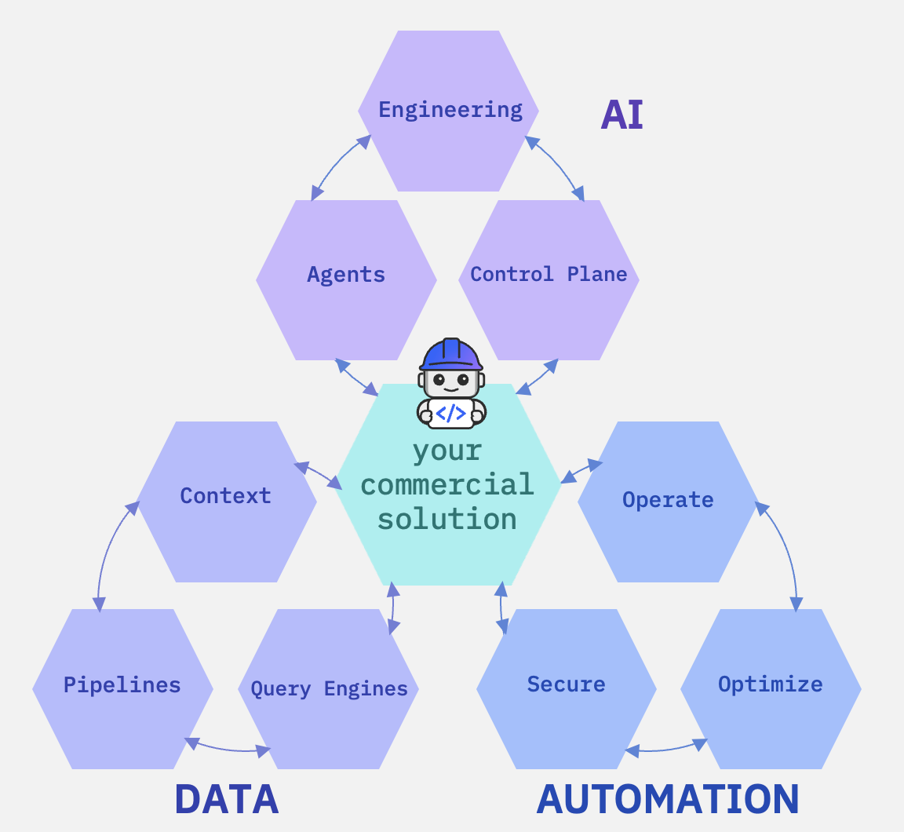

# Bob+ IBM Technology Building Blocks

**Bob+ IBM Technology Building Blocks** provide a unified digital experience for discovering, adopting, and implementing IBM technologies across AI and Automation. The Building Blocks encapsulate reusable, enterprise-ready capabilities spanning AI (Agents, Trust, and Data) and Automation (Build, Secure, and Optimize), enabling organizations to rapidly integrate IBM technologies into new and existing applications.

Powered by **IBM Bob**, developers, architects, partners, and technical teams receive AI-assisted guidance throughout the software development lifecycle—from discovering the appropriate Building Blocks and generating solution architectures to accelerating development, application modernization, cloud migration, deployment, and ongoing optimization. This AI-first experience improves developer productivity, promotes consistent engineering practices, reduces implementation risk, and accelerates time-to-value while maintaining enterprise-grade security, governance, scalability, and operational excellence.

# Digital Experience with Bob+

Bob+ delivers an AI-powered digital experience that enables developers, architects, partners, and enterprise teams to discover, build, modernize, migrate, and operate applications using IBM Technology Building Blocks. Rather than searching through multiple product documents, APIs, and best practices, users interact with a single intelligent assistant that understands enterprise architecture and recommends the right IBM capabilities for every stage of the software lifecycle.

Bob+ combines Generative AI with IBM Technology expertise to guide users from initial solution design through deployment and ongoing operations. By abstracting implementation complexity, teams can focus on delivering business value instead of building foundational capabilities from scratch.

Whether building new cloud-native applications, modernizing legacy workloads, migrating infrastructure, or optimizing production environments, Bob+ acts as an intelligent engineering companion that accelerates delivery while ensuring consistency, governance, and security.

## Capability Areas

**AI Core Capabilities**

- **Agents**
Reusable, enterprise-ready AI building blocks that accelerate agent adoption by enabling the design, orchestration, and deployment of intelligent agents across business workflows.

- **AI Control Plane**
AI Control Plane building blocks provide tools to evaluate AI models, test and monitor AI agents, enforce real-time safety guardrails, and manage regulatory compliance. They include model evaluation, agent ops, real-time guardrails, and AI compliance.

**[Data Core Capabilities](data-core/index.md)**

- **[Context](data-core/context/index.md)**  
  Where data is brought together and made trusted — combining real-time events, metadata enrichment, lineage, quality signals, and observability to give applications and AI the business context they need.

    | Building Block | What It Enables |
    |---|---|
    | [Context Hub](data-core/context/context-hub/index.md) | Combine real-time events, enterprise data, metadata, lineage and policy context for AI and analytics |
    | [Real-Time Streaming](data-core/context/real-time-streaming/index.md) | Stream, transform and govern continuously changing data |
    | [Metadata Enrichment & Data Quality](data-core/context/metadata-enrichment/index.md) | Add business meaning, quality rules, descriptions, terms, classifications and relationships to technical data |
    | [Data Observability](data-core/context/data-observability/index.md) | Detect pipeline and dataset issues before downstream users and AI are impacted |

- **[Pipelines](data-core/pipelines/index.md)**  
  Where data is prepared and moved into forms that applications, search systems, analytics, and AI can consume — covering RAG, document ingestion, Text2SQL, ETL/ELT, and large-file synchronization.

    | Building Block | What It Enables |
    |---|---|
    | [RAG](data-core/pipelines/rag/index.md) | Ground applications and agents with governed enterprise knowledge |
    | [UDI](data-core/pipelines/udi/index.md) | Ingest, parse, cleanse, chunk, enrich and prepare documents for RAG and AI |
    | [Text2SQL](data-core/pipelines/text2sql/index.md) | Convert natural-language questions into SQL using enriched metadata as context |
    | [ETL / ELT](data-core/pipelines/etl/index.md) | Build governed batch integration flows across source, transformation and target stages |
    | [Data Sync](data-core/pipelines/data-sync/index.md) | Synchronize large file sets and repositories securely across WAN and hybrid environments |

- **[Query Engines](data-core/query-engines/index.md)**  
  The consumption layer — enabling users, applications, analytics, and AI to access the right data through federated SQL, vector retrieval, and serverless compute without unnecessary data movement.

    | Building Block | What It Enables |
    |---|---|
    | [Zero-Copy Lakehouse](data-core/query-engines/zero-copy-lakehouse/index.md) | Query data across distributed platforms without unnecessary copying |
    | [Serverless Vector](data-core/query-engines/serverless-vector/index.md) | Elastic vector storage for semantic search, RAG and agent memory patterns |

---

**Automation Core Capabilities**

- **Build**
Enables secure, automated integration and workflow orchestration across applications and clouds. These building blocks deliver identity and access control, infrastructure automation, and AI-assisted development to support faster, governed deployments.

- **Secure**
Provides end-to-end security across identities, applications, and infrastructure using IBM Verify and HashiCorp Vault for secure access and centralized secrets management. It ensures protection of credentials, tokens, and certificates across their lifecycle with strong governance and control. Advanced capabilities from IBM Quantum Safe enable quantum-resistant encryption and future-ready data protection across hybrid environments.

- **Optimize**
Delivers continuous monitoring, policy enforcement, and self-healing workflows. These building blocks enable cost-efficient operations, dynamic resource management, and real-time observability to maintain optimal performance, governance, and financial efficiency across hybrid and multicloud environments.
